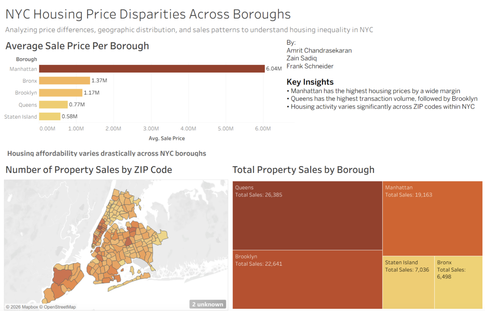

# NYC Housing Price Disparities

**Course:** Information Visualization (04:547:321) — Rutgers University–New Brunswick  
**Team:** Zain Sadiq, Amrit Chandrasekaran, Frank Schneider

---

## Overview

This project analyzes housing price disparities and transaction patterns across New York City's five boroughs. Using Tableau, we built an interactive dashboard that makes it easy to explore how affordability and sales activity vary by borough and ZIP code. The project also includes a physical poster installation displayed at the Rutgers Arts Library, designed for students considering a move to New York City after graduation.

---

## Data

**Source:** NYC Property Sales — public dataset via Kaggle  
**Coverage:** September 2016 to September 2017  
**Scope:** Housing transaction records across all five NYC boroughs

---

## Methods

**Data Preparation**

Combined five separate borough-level CSV files into a single unified dataset, added a borough label column to each record, and structured the data for analysis in Tableau.

**Visualization Design**

Developed an interactive Tableau dashboard featuring a choropleth map, a horizontal bar chart comparing average sale prices by borough, and a treemap showing transaction volume distribution. Visual encoding choices were made deliberately — darker colors correspond to higher-price areas, making Manhattan's outlier status immediately apparent. The map and treemap were designed to complement rather than duplicate each other, with the map showing geographic distribution of sales activity and the treemap showing proportional volume.

---

## Dashboard Preview

## Key Findings

Manhattan average sale prices are roughly ten times higher than Staten Island, making it a clear outlier among the boroughs. Queens leads all boroughs in transaction volume, followed closely by Brooklyn. High-value sales are geographically concentrated in Manhattan, while transaction activity is spread more broadly across the outer boroughs.

---

## Installation

The project includes a physical poster (11x17 format) installed at the Rutgers Arts Library. The poster provides a quick visual summary of the key findings, while the Tableau dashboard allows for deeper, interactive exploration of the data.

---

## Skills

Tableau, data cleaning, exploratory data analysis, cartographic visualization, dashboard design, information visualization

---

## Team Contributions

Zain Sadiq — project concept, dataset selection, overall direction  
Amrit Chandrasekaran — Tableau dashboard development, data analysis, visualization design  
Frank Schneider — physical poster design, installation assembly, presentation planning
